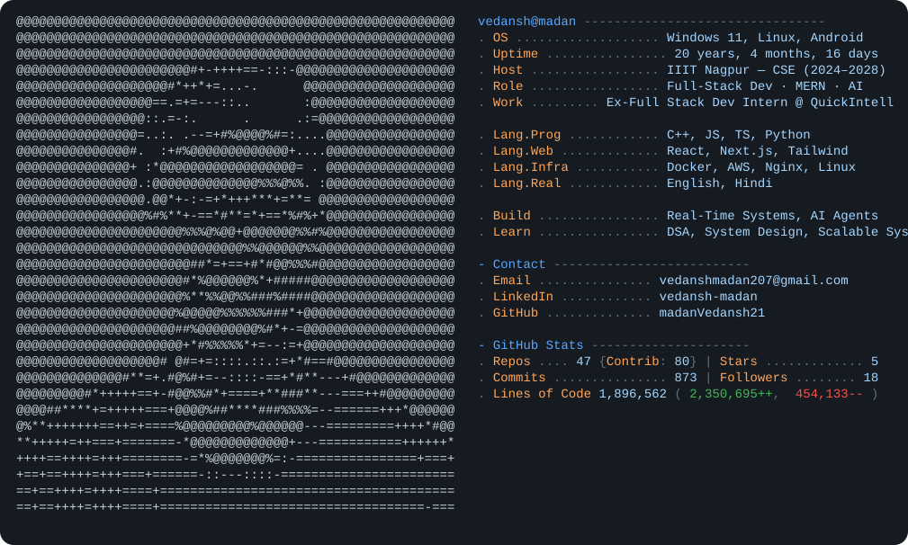

  <picture>
    <source media="(prefers-color-scheme: dark)"  srcset="dark_mode.svg">
    <source media="(prefers-color-scheme: light)" srcset="light_mode.svg">
    
  </picture>

<!-- ─── Quick Connect & Links (Clickable) ────────────────────────────────── -->

  
  &nbsp;
  
  &nbsp;
  
  &nbsp;
  

<!-- ─── Tech Stack ───────────────────────────────────────────────────────── -->

### 💻 Technologies & Tools

  <!-- Languages -->
  
  
  
  
  <!-- Frontend -->
  
  
  
  <!-- Backend -->
  
  
  
  <!-- Databases -->
  
  
  
  <!-- DevOps -->
  
  
  
  

